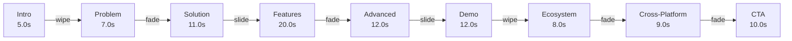
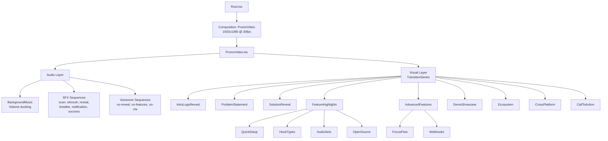
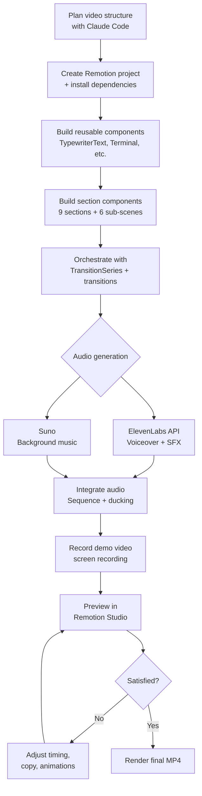

# echook - Promotional Video

A professional promotional video for [echook](https://github.com/ChanMeng666/echook) (formerly `claude-code-audio-hooks`), built entirely with code using **Remotion**, **Claude Code**, **ElevenLabs**, and **Suno**.

## Video Output

https://github.com/user-attachments/assets/3504d214-efac-4e01-84c0-426430b842d6

<details>
<summary>Previous versions</summary>

### v1.0

https://github.com/user-attachments/assets/f3c7ad69-f336-400a-bf57-c14943b35a0a

</details>

## Overview

| Property | Value |
|----------|-------|
| Resolution | 1920 x 1080 (Full HD) |
| Frame Rate | 30 fps |
| Duration | ~88.7 seconds (2660 frames) |
| Format | MP4 (H.264) |
| Font | Inter (Google Fonts) |
| Brand Colors | `#16F800` (green), `#000000` (black) |
| Version | v5.2.1 |

## Video Structure

The video is composed of 9 sections connected with smooth transitions:



### Section Timeline

| # | Section | Duration | Description |
|---|---------|----------|-------------|
| 1 | Intro / Logo Reveal | 5.0s | Scan line sweep, logo materialization, particle burst (v5.2.1) |
| 2 | Problem Statement | 7.0s | Terminal shows missed authorization, red vignette |
| 3 | Solution Reveal | 11.0s | Dramatic circle reveal, badges: 26 Hook Types, Focus Flow, Webhooks |
| 4 | Feature Highlights | 20.0s | 4 sub-scenes (Quick Setup, 26 Hook Types, Audio Sets, Open Source) |
| 5 | Advanced Features | 12.0s | 2 sub-scenes (Focus Flow with real screenshot, Webhooks: Slack/Discord/Teams/ntfy) |
| 6 | Demo Showcase | 12.0s | Real screen recording of the product in action |
| 7 | Ecosystem | 8.0s | Smart Matchers, Async Execution, Snooze feature cards |
| 8 | Cross-Platform | 9.0s | 3 AI-editor icons (Claude Code · Cursor · Codex CLI), 4 animated counters (26 hooks, 5 channels) |
| 9 | Call to Action | 10.0s | Quick Setup curl command, GitHub link, tagline |

### Audio Layer

The video includes a layered audio design with automatic volume ducking:

```mermaid
gantt
    title Audio Timeline (approximate)
    dateFormat X
    axisFormat %s

    section BGM
    Background Music (with ducking) :0, 2660

    section SFX
    Scan Line     :15, 75
    Whoosh T1     :125, 155
    Whoosh T2     :315, 345
    Reveal Impact :335, 410
    Whoosh T3     :625, 655
    Notification  :945, 990
    Whoosh T4     :1205, 1235
    Breathe SFX   :1225, 1345
    Whoosh T5     :1545, 1575
    Whoosh T6     :1885, 1915
    Whoosh T7     :2105, 2135
    Success Chime :2170, 2215
    Whoosh T8     :2355, 2385

    section Voiceover
    VO Reveal     :355, 610
    VO Features   :1260, 1360
    VO CTA        :2480, 2630
```



## Quick Start

### Prerequisites

- [Node.js](https://nodejs.org/) v18+
- npm

### Install & Preview

```bash
# Clone the repository
git clone https://github.com/ChanMeng666/claude-code-audio-hooks-promo-video.git
cd claude-code-audio-hooks-promo-video

# Install dependencies
npm install

# Start Remotion Studio (live preview)
npm run dev
```

### Render the Video

```bash
# Render to MP4 (output: out/promo-video.mp4)
npm run render
```

## Project Structure

```
claude-code-audio-hooks-promo-video/
├── public/                          # Static assets
│   ├── claude-code-audio-hooks-logo.svg
│   ├── demo-task-complete.mp4       # Screen recording
│   ├── demo-focus-flow.png          # Focus Flow screenshot
│   ├── bgm.mp3                      # Background music (Suno)
│   ├── vo-reveal.mp3                # Voiceover (ElevenLabs)
│   ├── vo-features.mp3              # Voiceover (ElevenLabs)
│   ├── vo-cta.mp3                   # Voiceover (ElevenLabs)
│   ├── sfx-scan.mp3                 # Sound effect (ElevenLabs)
│   ├── sfx-whoosh.mp3               # Sound effect (ElevenLabs)
│   ├── sfx-reveal.mp3               # Sound effect (ElevenLabs)
│   ├── sfx-breathe.mp3              # Sound effect (ElevenLabs)
│   ├── sfx-notification.mp3         # Sound effect (ElevenLabs)
│   └── sfx-success.mp3              # Sound effect (ElevenLabs)
├── scripts/
│   └── generate-audio.mjs           # ElevenLabs audio generation
├── src/
│   ├── Root.tsx                      # Remotion entry point
│   ├── PromoVideo.tsx                # Main orchestrator (TransitionSeries + Audio)
│   ├── constants.ts                  # Colors, durations, dimensions
│   ├── sections/                     # 9 video sections
│   │   ├── IntroLogoReveal.tsx
│   │   ├── ProblemStatement.tsx
│   │   ├── SolutionReveal.tsx
│   │   ├── FeatureHighlights.tsx     # Sub-scene orchestrator
│   │   ├── features/
│   │   │   ├── QuickSetup.tsx
│   │   │   ├── HookTypes.tsx
│   │   │   ├── AudioSets.tsx
│   │   │   └── OpenSource.tsx
│   │   ├── AdvancedFeatures.tsx      # Focus Flow + Webhooks
│   │   ├── DemoShowcase.tsx
│   │   ├── Ecosystem.tsx             # Smart Matchers + Async + Snooze
│   │   ├── CrossPlatform.tsx
│   │   └── CallToAction.tsx
│   └── components/                   # Reusable visual components
│       ├── TypewriterText.tsx        # Typewriter text effect
│       ├── Terminal.tsx              # Terminal window frame
│       ├── SoundWave.tsx             # Animated equalizer bars
│       ├── GreenGrid.tsx             # Animated grid + scan line
│       ├── PlatformIcon.tsx          # Platform icons (react-icons)
│       ├── CounterNumber.tsx         # Animated counting numbers
│       └── GlowText.tsx             # Pulsing green glow text
├── .env.example                      # Environment variable template
├── package.json
├── remotion.config.ts
└── tsconfig.json
```

## Architecture



### Key Patterns

- **TransitionSeries**: Sections are connected with `wipe`, `fade`, and `slide` transitions from `@remotion/transitions`. Transitions overlap adjacent sections, so the effective total is less than the sum of all durations.
- **Sequence-based Audio**: Each audio cue is placed at an exact global frame using `<Sequence from={frame}>` with `<Audio>` inside. This allows precise synchronization.
- **Volume Ducking**: The `BackgroundMusic` component uses multiple `interpolate()` calls multiplied together to duck during demo playback and voiceover sections.
- **Sub-scene Orchestration**: `FeatureHighlights` uses nested `<Sequence>` components with `durationInFrames` to reset `useCurrentFrame()` for each sub-scene, so each sub-scene animates from frame 0.

## Audio Generation

### ElevenLabs (Voiceover + Sound Effects)

The `scripts/generate-audio.mjs` script automates audio generation via the ElevenLabs API.

```bash
# 1. Copy the environment template
cp .env.example .env

# 2. Add your ElevenLabs API key to .env
#    ELEVENLABS_API_KEY=sk_your_key_here

# 3. Run the generation script
npm run generate-audio
```

The script generates:

| File | Type | API Endpoint | Description |
|------|------|-------------|-------------|
| `vo-reveal.mp3` | Voiceover | `/text-to-speech` | "Introducing echook. Twenty-six hooks. Three AI editors. Zero latency. Total awareness." |
| `vo-features.mp3` | Voiceover | `/text-to-speech` | "Focus Flow keeps you centered. Webhooks keep you connected." |
| `vo-cta.mp3` | Voiceover | `/text-to-speech` | "Never miss a notification. Never lose your flow. Try it in 30 seconds." |
| `sfx-scan.mp3` | SFX | `/sound-generation` | Futuristic digital scan line sweep |
| `sfx-whoosh.mp3` | SFX | `/sound-generation` | Cinematic whoosh transition |
| `sfx-reveal.mp3` | SFX | `/sound-generation` | Dramatic reveal impact |
| `sfx-breathe.mp3` | SFX | `/sound-generation` | Calming ambient breathing tone |
| `sfx-notification.mp3` | SFX | `/sound-generation` | Digital notification chime |
| `sfx-success.mp3` | SFX | `/sound-generation` | Achievement completion chime |
| `bgm.mp3` | Music | `/music` | Background music (requires paid plan) |

> **Note**: ElevenLabs music generation (`/music`) requires a paid plan. If unavailable, use [Suno](https://suno.com) as an alternative (see below).

### Suno (Background Music Alternative)

If ElevenLabs music generation is not available, use this prompt on [Suno](https://suno.com):

```
Dark cinematic electronic ambient instrumental track.
Futuristic, minimal, polished synth soundscape.
Starts with soft digital pulse, builds tension with atmospheric pads,
then opens into a confident mid-tempo electronic groove with clean arpeggiated synths.
Tech product promotional feel. Subtle bass, no vocals, no guitar.
D minor, 100 BPM, 72 seconds.
```

Download the result and save it as `public/bgm.mp3`.

## Production Workflow

This is the end-to-end workflow used to create this video:



### Tips for Adapting This Project

1. **Change the product**: Update text in section components, swap the logo SVG, and replace `demo-task-complete.mp4` with your own screen recording.
2. **Adjust timing**: All durations are centralized in `src/constants.ts`. Modify `DURATIONS` and `TOTAL_FRAMES` to change pacing.
3. **Change brand colors**: Update `COLORS` in `src/constants.ts`. The green/black theme propagates everywhere.
4. **Add/remove sections**: Add a new `<TransitionSeries.Sequence>` + `<TransitionSeries.Transition>` in `PromoVideo.tsx`, update `DURATIONS` and `TOTAL_FRAMES`.
5. **Swap audio**: Replace files in `public/` or modify the ElevenLabs prompts in `scripts/generate-audio.mjs`.

## Tools Used

| Tool | Purpose |
|------|---------|
| [Remotion](https://remotion.dev) | React-based programmatic video creation |
| [Claude Code](https://claude.com/claude-code) | AI-assisted code generation for all components |
| [ElevenLabs](https://elevenlabs.io) | AI voiceover (TTS) and sound effect generation |
| [Suno](https://suno.com) | AI background music generation |
| [react-icons](https://react-icons.github.io/react-icons/) | Professional SVG icon library |
| [@remotion/google-fonts](https://remotion.dev/docs/google-fonts) | Font loading (Inter) |
| [@remotion/transitions](https://remotion.dev/docs/transitions) | Scene transitions (fade, wipe, slide) |

## License

Note that for some entities a Remotion company license is needed. [Read the terms here](https://github.com/remotion-dev/remotion/blob/main/LICENSE.md).
